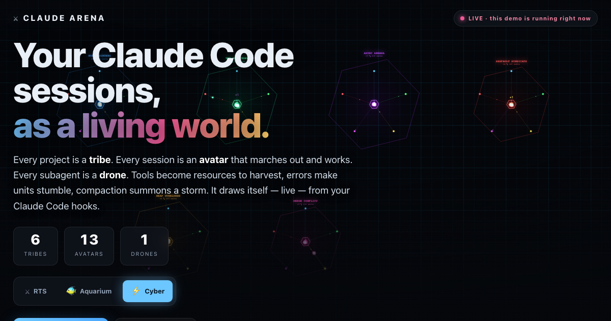
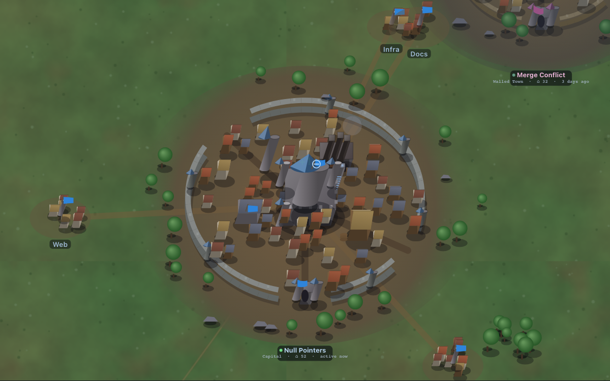
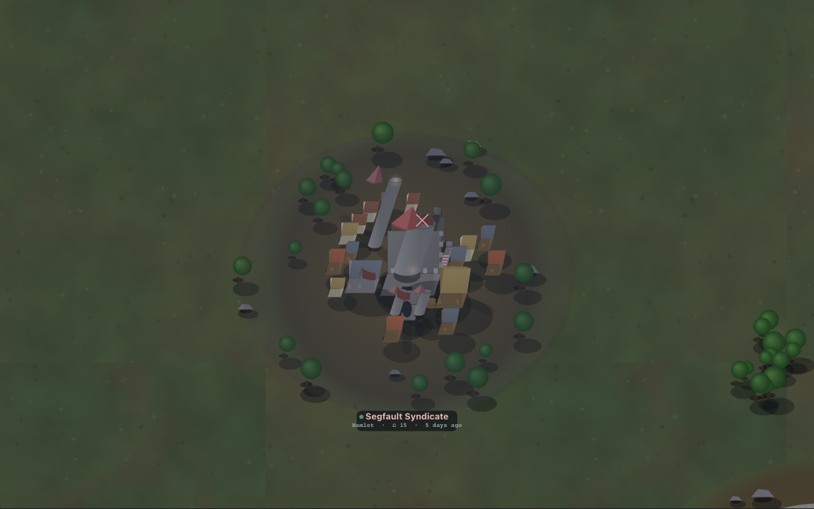
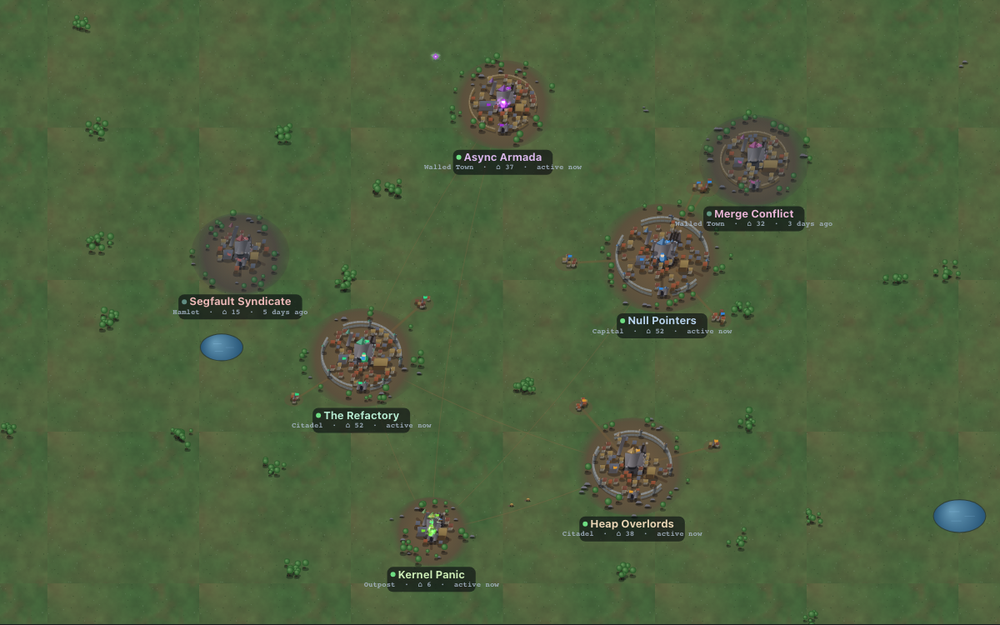

<div align="center">


# ⚔ Claude Arena

### Your Claude Code sessions, as a living RTS-aquarium.

**Every project is a tribe. Every session is an avatar. Every subagent is a drone.**
A living world that draws itself — live — from your Claude Code hooks.

### 🌐 **[claudearena.remotebb.com](https://claudearena.remotebb.com)** — live interactive demo

[**Install**](#-30-second-start) · [**How it works**](#how-it-actually-works) · [**Made to evolve**](#made-to-watch-evolve) · [**Privacy**](#privacy-the-short-honest-version)

   



</div>

---

It runs in your browser, off to the side, and you check on it like a fish tank —
except the fish are your own sessions grinding through your actual work.

It is powered **entirely by Claude Code hooks**. No polling, no log scraping, no
telemetry phoning home. A hook drops a line in a file, a tiny local server reads
the file, your browser draws a world. That's the whole trick.

## Why this exists

Because staring at a streaming wall of tool calls is how robots have fun, and you
are (presumably) not a robot. You spin up four agents across three projects and
then... what? You watch text scroll. Boring.

Now you watch **Async Armada** dispatch a scout to the watchtower while **The
Refactory** deploys three drones into the fog and **Null Pointers**' lone worker
quietly naps by the command center because its session hit `Stop`.

Same information. Infinitely more "oh no it's 2am and I'm naming my projects."

## Made to watch evolve

This is the whole point. Everything below is derived from **real data only** —
lifetime tool & session counts, first-seen dates, and the wall clock. No faked
activity, no invented numbers. (See it live on the
[demo](https://claudearena.remotebb.com).)

| 🏰 It grows through eras | 🍂 It weathers & revives | 🗺️ It reads at a glance |
|---|---|---|
|  |  |  |
| **Outpost → Hamlet → Walled Town → Citadel → Capital.** Each tier unlocks real structure: palisades become stone walls, the keep gains a gilded roof, towers rise. Cross a threshold while you're away and the town is *structurally different* when you return. | Banners droop, colour drains, and moss creeps over a project gone quiet — honest neglect, never deletion. The instant a real session fires, life floods back and a worker spawns. Age leaves a permanent **patina**; idleness only veils it. | Each town is sized by its lifetime work and ringed by a colour that says worked-today vs idle-for-weeks. A Bash-heavy project grows forge chimneys; a Read-heavy one sprouts watchtowers — every town a recognizable **silhouette**. |

And when you open it after time away, a **town crier** greets you with exactly
what changed: *"4 days away: +3 sessions, +812 tools, Null Pointers reached
Citadel."* — with a **▶ Watch it unfold** button that time-lapses just the
period you missed.

**Drill in.** Click any town for its dossier — era, founding date, a **work
signature** bar (how the project is actually worked: Bash vs Edit vs Read…), a
**21-day activity** sparkline, its **districts** (subfolders), and named
**heroes** you can *click to follow* around the world. A **Chronicle** records
the milestones it has crossed.

> The world is one **RTS** today. The engine is a shared sim + a procedural
> renderer, so cozy-aquarium and neon-cyber skins are on the way — same data,
> different lens.

## ⚡ 30-second start

```bash
# 1. wire the capture hook into Claude Code (backs up your settings first)
node install.js

# 2. start the arena
node server.js

# 3. open it
open http://localhost:4787
```

Then go use Claude Code like you normally would. The world fills itself in.

**Want to see it alive right now,** before any real sessions run?

```bash
node server.js --demo
```

…or just click the **✦ Demo** button. No `npm install`. No build step. No
dependencies. It's Node built-ins and a canvas. If you have Node 18+, you have
everything.

## What each hook does in the game

The whole thing is a state machine fed by Claude Code's hook events:

| Hook event | What happens on screen |
|---|---|
| `SessionStart` | A worker awakens — spawns from the base in a burst of particles. |
| `UserPromptSubmit` | That worker perks up with a **!** — it just got orders. |
| `PreToolUse` | Worker marches to the matching resource station and harvests. The tool decides which: |
| ↳ `Bash` | → **gas geyser** (running commands) |
| ↳ `Edit` / `Write` | → **mineral crystals** (building things) |
| ↳ `Read` / `Grep` / `Glob` | → **watchtower** (scouting) |
| ↳ `WebFetch` / `WebSearch` | → **warp gate** (expeditions) |
| ↳ `Task` / `Agent` / `Workflow` | → spawns a **drone** that fans out (your subagent!) |
| `PostToolUse` | Worker hauls the resource home, **+1** pops, the stockpile grows. Errors make it **stumble** in red. |
| `SubagentStop` | A drone zooms back to base and merges in a flash. |
| `Stop` | The **Stop-Beat**: the town exhales a warm bloom (scaled by the turn's work), mints the banked work into its coffers, fires a caravan down the King's Highway, feeds your planted saplings, and the worker heads home to nap (**z**). |
| `SessionEnd` | The worker salutes and walks back in. Gone, but its work counts forever. |
| `Notification` | The base fires a beacon ping. |
| `PreCompact` | A **memory storm** — units swirl around the base while context compacts. |

A session that goes quiet for a while wanders off on its own, so the world never
becomes an unbounded swarm. Population tracks *actual* activity.

## It grows. That's the point.

This isn't a dashboard that resets when you blink. The server keeps **lifetime
stats per tribe** and a tribe's **level** climbs (sub-linearly, so it never
explodes). Higher level = bigger territory, more outlying buildings, taller
coral, a longer neon perimeter. Leave it running a week and your busiest project
visibly becomes a sprawling capital while that repo you touched twice stays a
humble outpost.

## A living, interactive world

It isn't a static diorama — it lives, and you can shape it:

- **One tribe per project, with districts.** Every session launched inside a
  project folder belongs to the same tribe (resolved to the project root) — and
  each **subfolder** (`myproj/outputs/run-3`) becomes a visible **satellite
  settlement** ringing the capital, joined by a road and flying the tribe's
  banner. The main folder is the capital; the subfolders are its districts, each
  with its own little life and stats (see them in the dossier).
- **The Stop-Beat.** Finishing a turn (the `Stop` hook) makes the town *exhale*:
  a warm tide of light blooms from the keep, scaled by how much work that turn
  did, and the work crystallizes into the town's coffers. The single heartbeat of
  the world, landing exactly when *you* feel done.
- **Inter-tribe action.** Work two projects in the same window and a **King's
  Highway** wears in between their towns — it accrues and deepens over time
  (desire-path → cobbled road) and **caravans** trundle along it on each Stop.
- **Plant things that grow from your work.** Hit **🌱 Plant**, click inside a
  town, and drop a sapling. It grows into a grove fed by that town's real
  Stop-Beats — a little life of its own, persisted across visits.
- **Wilder land.** Towns scatter organically across terrain with ponds, forest
  clusters, and rocky outcrops; fireflies drift around living towns at night;
  neglected towns sink into a beautiful teal-and-amber dusk instead of going grey.

## ⏳ Watch the whole history

Hit **⏳ History** to drop into a **time-lapse**. Scrub the timeline to any
moment and play forward at an **adaptive speed** — 1× walks the whole span in
~30 seconds, and 0.5× / 2× / 4× speed it up or down — watching your towns rise
from a single Outpost as eras cross, walls go up, and day and night flicker past.
It replays the real timestamped event log, rebuilding the world exactly as it was
at any point. Hit **● LIVE** to snap back to now.

## Curate your tribes

Click any town to zoom in and open its **dossier** — era, founding date, named
heroes, milestone Chronicle — then **rename** it (defaults to your folder name,
prettified — `my-cool-app` → "My Cool App"), give it a **motto**, and pick its
**color** and **crest**. Edits persist in `~/.claude/claude-arena/overrides.json`.

## Controls

| Action | How |
|---|---|
| Pan / Zoom | drag / scroll |
| Frame everything | **R** or the ⤢ button |
| Inspect / curate a town | click it (camera zooms in + dossier opens) |
| Plant a sapling | **🌱 Plant**, then click inside a town |
| Time-lapse history | **⏳ History** (scrub + speed; **● LIVE** to exit) |
| Postcard | the ⤓ button (stamps name · era · stats) |

## Privacy (the short, honest version)

- The server binds to **`127.0.0.1` only** by default. Your machine, your eyes.
- The browser is told **that** things happened — event type, project, tool name —
  but never **what**. Your prompt text and tool output **never leave the server**.
- Nothing is sent anywhere. No analytics. Only localhost ↔ your browser.

Want to watch from your phone on the same LAN? `CLAUDE_ARENA_HOST=0.0.0.0` and
accept that anyone on your network can then see project *names* and tool names.

## How it actually works

```
Claude Code
   │  (fires a hook on every event)
   ▼
hooks/arena-hook.sh        ← tiny, dumb, fast. reads stdin JSON, appends one
   │                          line to the log, exits 0. never blocks Claude.
   ▼
~/.claude/claude-arena/events.ndjson   ← source of truth. survives restarts.
   │
   ▼
server.js                  ← tails the file, normalizes events (schema-agnostic,
   │                          so a renamed field can't break it), keeps lifetime
   │                          faction stats, serves the UI + a live SSE stream.
   ▼
your browser               ← shared world-sim + lore (eras/vitality/patina) +
                              a procedural canvas renderer. no image assets.
```

The hook does almost nothing on purpose — all the smarts live in the server, so
the thing on your `PreToolUse` critical path is a `printf` and an exit. If the
server is off when hooks fire, events pile up in the file and the world rebuilds
itself the next time you start it.

### Layout

```
server.js                  the local server (tail + normalize + SSE + static)
install.js / uninstall.js  wire the hook into ~/.claude/settings.json (reversibly)
hooks/arena-hook.sh        the capture hook
public/
  art.js                   2.5D projection · lighting · day/night · shaded primitives
  lore.js                  eras · vitality · patina · fingerprint · milestones (pure, from real data)
  sim.js                   the world — towns built from history, named units, drones
  renderers/rts.js         the procedural RTS renderer
  replay.js                time-lapse: re-grows the world at any point in history
  game.js                  bootstrap: camera, input, panel, return-beat, plant, history, postcard
site/                      the landing page (the public demo at claudearena.remotebb.com)
```

The local app (`public/`) and the public demo (`site/`) share the exact same
engine — `art.js` + `lore.js` + `sim.js` + the renderer. The only difference: the
app gets its events from your real hooks over SSE; the demo seeds fictional towns
in the browser.

## Troubleshooting

- **World is empty?** Run a Claude session since installing, or hit **✦ Demo**.
- **0 tribes after working?** Confirm `node install.js` ran and you started a
  *new* session (hooks load at session start). Check that
  `~/.claude/claude-arena/events.ndjson` is growing.
- **Port 4787 taken?** `CLAUDE_ARENA_PORT=5000 node server.js`.
- **Want it gone?** `node uninstall.js` removes only the arena hooks, backs up
  first, and leaves the rest of your `settings.json` untouched.

## Install details (for the appropriately paranoid)

`install.js` **appends** a hook to each event — it runs *alongside* your existing
hooks, never replacing them. It's idempotent, backs up `settings.json` to a
timestamped file first, and refuses to proceed if your settings JSON doesn't
parse rather than helpfully corrupting it. Events hooked: `SessionStart`,
`SessionEnd`, `UserPromptSubmit`, `Stop`, `PreToolUse`, `PostToolUse`,
`SubagentStop`, `Notification`, `PreCompact`.

---

<div align="center">

Built to be left open in the corner of a second monitor while you and a small
army of Claudes get things done. Check on the tank. Name a legion. Get back to work.

**[claudearena.remotebb.com](https://claudearena.remotebb.com)** · made with Claude Code

</div>
