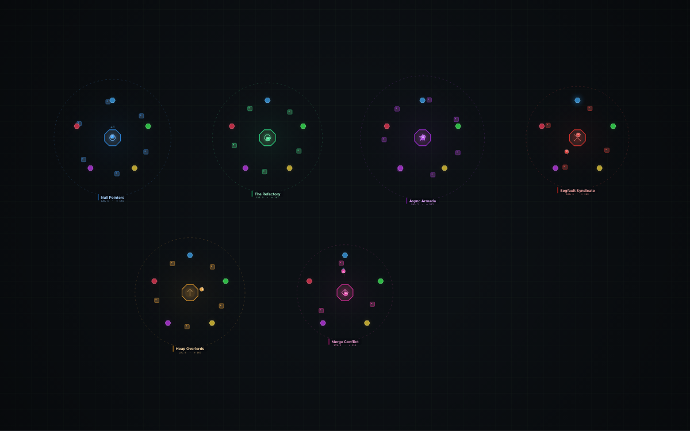
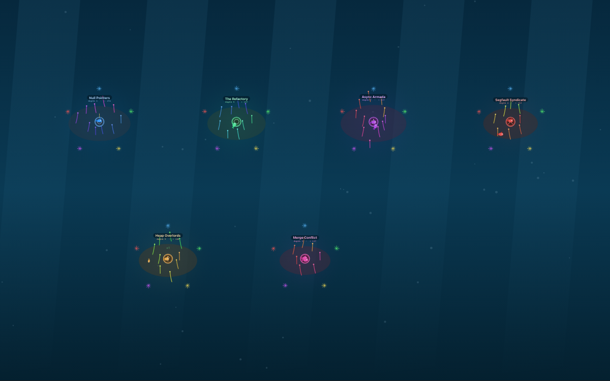
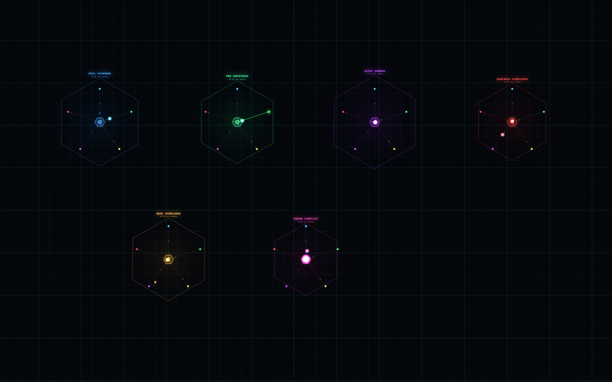

<div align="center">


# ⚔ Claude Arena

### Your Claude Code sessions, as a living RTS-aquarium.

**Every project is a tribe. Every session is an avatar. Every subagent is a drone.**
A living world that draws itself — live — from your Claude Code hooks.

### 🌐 **[claudearena.remotebb.com](https://claudearena.remotebb.com)** — live interactive demo

[**Install**](#-30-second-start) · [**How it works**](#how-it-actually-works) · [**The three skins**](#three-worlds-one-backend) · [**Privacy**](#privacy-the-short-honest-version)

   


</div>

---

It runs in your browser, off to the side, and you check on it like a fish tank —
except the fish are your own sessions grinding through your actual work.

It is powered **entirely by Claude Code hooks**. No polling, no log scraping, no
telemetry phoning home. A hook drops a line in a file, a tiny local server reads
the file, your browser draws a world. That's the whole trick.

## Why this exists

Because staring at a streaming wall of tool calls is how robots have fun, and you
are (presumably) not a robot. You spin up four agents across three projects and
then... what? You watch text scroll. Boring.

Now you watch **Async Armada** dispatch a scout to the watchtower while **The
Refactory** deploys three drones into the fog and **Null Pointers**' lone worker
quietly naps by the command center because its session hit `Stop`.

Same information. Infinitely more "oh no it's 2am and I'm naming my projects."

## Three worlds, one backend

Same world, same data, three completely different ways to look at it. Hit **Tab**
to cycle, press **1 / 2 / 3**, or click the toggle. (Try it live on the
[demo](https://claudearena.remotebb.com).)

| RTS | Aquarium | Cyber |
|---|---|---|
|  |  |  |
| Top-down StarCraft energy. Command centers, hex resource nodes, visored workers with marching legs, territory that grows with your level. | A cozy reef tank. Bases are coral, units are fish, tools are anemones, light shafts drift through the water. | Dark grid, neon everything, glowing motion trails, energy conduits pulsing packets between nodes. Screenshot bait. |

There's **one simulation** and the skins are pure render layers, so adding a
fourth (isometric medieval village? ant colony?) is a single file that reads the
same world state.

## ⚡ 30-second start

```bash
# 1. wire the capture hook into Claude Code (backs up your settings first)
node install.js

# 2. start the arena
node server.js

# 3. open it
open http://localhost:4787
```

Then go use Claude Code like you normally would. The world fills itself in.

**Want to see it alive right now,** before any real sessions run?

```bash
node server.js --demo
```

…or just click the **✦ Demo** button. No `npm install`. No build step. No
dependencies. It's Node built-ins and a canvas. If you have Node 18+, you have
everything.

## What each hook does in the game

The whole thing is a state machine fed by Claude Code's hook events:

| Hook event | What happens on screen |
|---|---|
| `SessionStart` | A worker awakens — spawns from the base in a burst of particles. |
| `UserPromptSubmit` | That worker perks up with a **!** — it just got orders. |
| `PreToolUse` | Worker marches to the matching resource station and harvests. The tool decides which: |
| ↳ `Bash` | → **gas geyser** (running commands) |
| ↳ `Edit` / `Write` | → **mineral crystals** (building things) |
| ↳ `Read` / `Grep` / `Glob` | → **watchtower** (scouting) |
| ↳ `WebFetch` / `WebSearch` | → **warp gate** (expeditions) |
| ↳ `Task` / `Agent` / `Workflow` | → spawns a **drone** that fans out (your subagent!) |
| `PostToolUse` | Worker hauls the resource home, **+1** pops, the stockpile grows. Errors make it **stumble** in red. |
| `SubagentStop` | A drone zooms back to base and merges in a flash. |
| `Stop` | The session's worker heads home and naps (**z**) by the command center. |
| `SessionEnd` | The worker salutes and walks back in. Gone, but its work counts forever. |
| `Notification` | The base fires a beacon ping. |
| `PreCompact` | A **memory storm** — units swirl around the base while context compacts. |

A session that goes quiet for a while wanders off on its own, so the world never
becomes an unbounded swarm. Population tracks *actual* activity.

## It grows. That's the point.

This isn't a dashboard that resets when you blink. The server keeps **lifetime
stats per tribe** and a tribe's **level** climbs (sub-linearly, so it never
explodes). Higher level = bigger territory, more outlying buildings, taller
coral, a longer neon perimeter. Leave it running a week and your busiest project
visibly becomes a sprawling capital while that repo you touched twice stays a
humble outpost.

## Curate your tribes

Click any base to **rename** it (defaults to your folder name, prettified —
`my-cool-app` → "My Cool App"), give it a **motto**, and pick its **color** and
**crest**. Edits persist in `~/.claude/claude-arena/overrides.json`. Build your
little lore.

## Controls

| Action | How |
|---|---|
| Pan / Zoom | drag / scroll |
| Frame everything | **R** or the ⤢ button |
| Toggle auto-framing | **Space** |
| Swap skin | **Tab**, or **1** / **2** / **3** |
| Curate a tribe | click its base |
| Screenshot | the ⤓ button |

## Privacy (the short, honest version)

- The server binds to **`127.0.0.1` only** by default. Your machine, your eyes.
- The browser is told **that** things happened — event type, project, tool name —
  but never **what**. Your prompt text and tool output **never leave the server**.
- Nothing is sent anywhere. No analytics. Only localhost ↔ your browser.

Want to watch from your phone on the same LAN? `CLAUDE_ARENA_HOST=0.0.0.0` and
accept that anyone on your network can then see project *names* and tool names.

## How it actually works

```
Claude Code
   │  (fires a hook on every event)
   ▼
hooks/arena-hook.sh        ← tiny, dumb, fast. reads stdin JSON, appends one
   │                          line to the log, exits 0. never blocks Claude.
   ▼
~/.claude/claude-arena/events.ndjson   ← source of truth. survives restarts.
   │
   ▼
server.js                  ← tails the file, normalizes events (schema-agnostic,
   │                          so a renamed field can't break it), keeps lifetime
   │                          faction stats, serves the UI + a live SSE stream.
   ▼
your browser               ← one shared world-sim, three swappable renderers.
                              all canvas, no image assets.
```

The hook does almost nothing on purpose — all the smarts live in the server, so
the thing on your `PreToolUse` critical path is a `printf` and an exit. If the
server is off when hooks fire, events pile up in the file and the world rebuilds
itself the next time you start it.

### Layout

```
server.js                  the local server (tail + normalize + SSE + static)
install.js / uninstall.js  wire the hook into ~/.claude/settings.json (reversibly)
hooks/arena-hook.sh        the capture hook
public/                    the local app — index.html, sim.js, game.js, renderers/
site/                      the landing page (the public demo at claudearena.remotebb.com)
```

The local app (`public/`) and the public demo (`site/`) share the exact same
engine — `sim.js` + `renderers/`. The only difference: the app gets its events
from your real hooks over SSE; the demo generates fictional ones in the browser.

## Troubleshooting

- **World is empty?** Run a Claude session since installing, or hit **✦ Demo**.
- **0 tribes after working?** Confirm `node install.js` ran and you started a
  *new* session (hooks load at session start). Check that
  `~/.claude/claude-arena/events.ndjson` is growing.
- **Port 4787 taken?** `CLAUDE_ARENA_PORT=5000 node server.js`.
- **Want it gone?** `node uninstall.js` removes only the arena hooks, backs up
  first, and leaves the rest of your `settings.json` untouched.

## Install details (for the appropriately paranoid)

`install.js` **appends** a hook to each event — it runs *alongside* your existing
hooks, never replacing them. It's idempotent, backs up `settings.json` to a
timestamped file first, and refuses to proceed if your settings JSON doesn't
parse rather than helpfully corrupting it. Events hooked: `SessionStart`,
`SessionEnd`, `UserPromptSubmit`, `Stop`, `PreToolUse`, `PostToolUse`,
`SubagentStop`, `Notification`, `PreCompact`.

---

<div align="center">

Built to be left open in the corner of a second monitor while you and a small
army of Claudes get things done. Check on the tank. Name a legion. Get back to work.

**[claudearena.remotebb.com](https://claudearena.remotebb.com)** · made with Claude Code

</div>
